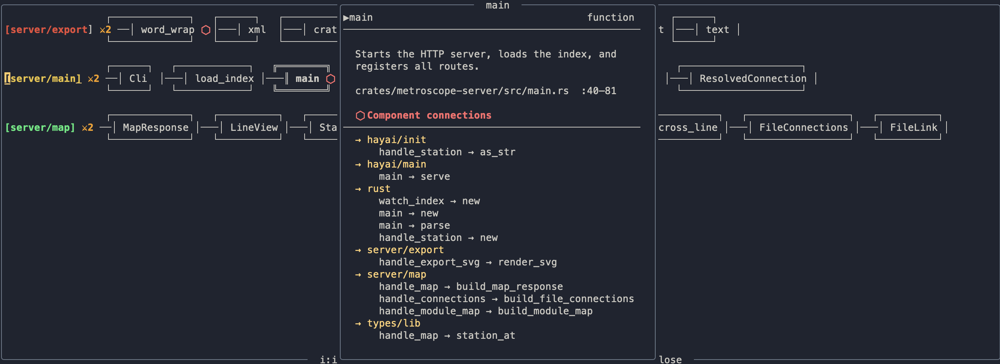

# Metroscope

Visualize a codebase as an interactive metro map. Navigate code like a city transit system — functions are stations, files are lines, you are always in the middle.

**Goal: comprehension, not generation.** The LLM runs once at index time, caches summaries at every abstraction level, and serves them instantly at query time.

```
[auth      ] ──●──────────────●──────────────◉──────────
                 authenticate   check_token    verify_jwt ← you are here

[db        ] ──●──────────────●─────────────────────────
                 connect        query
```



---

## How It Works

```
Neovim plugin  →  HTTP :7777  →  metroscope-server  →  .metroscope/index.json
                                                              ↑
                                                    metroscope-indexer
                                                    (tree-sitter + Claude API)
```

1. **Index once** — the indexer parses your codebase, calls Claude to generate summaries at function, file, and system level, and writes `.metroscope/index.json`
2. **Serve instantly** — the server loads the index and answers queries with no LLM calls
3. **Navigate** — the Neovim plugin sends your cursor position, renders the map, lets you explore

---

## Requirements

- Rust (for building the indexer and server)
- Neovim 0.10+
- An Anthropic API key (for indexing only)
- `uvx` (for optional Serena LSP enrichment)

---

## Installation

### 1. Build the binaries

```bash
git clone https://github.com/igorgn/metroscope
cd metroscope
cargo build --release

cp target/release/metroscope-indexer ~/.local/bin/
cp target/release/metroscope-server ~/.local/bin/
```

### 2. Install the Neovim plugin

With [lazy.nvim](https://github.com/folke/lazy.nvim):

```lua
{
  dir = "/path/to/metroscope/neovim/metroscope.nvim",
  config = function()
    require("metroscope").setup({
      server      = "http://127.0.0.1:7777",  -- default
      leader      = "<leader>m",
    })
    require("promptline").setup({
      backend = "anthropic_api",  -- or "claude_cli" / "copilot_chat"
    })
  end,
}
```

### 3. Index your project

```bash
metroscope-indexer index /path/to/your/project --api-key $ANTHROPIC_API_KEY
```

Takes ~1-2 minutes depending on codebase size. Writes `.metroscope/index.json`.

### 4. Start the server

```bash
metroscope-server --index-path /path/to/your/project --port 7777
```

Keep this running in the background while you work.

---

## Usage

Open any file and press `<leader>ms`. Metroscope opens on the module your current file belongs to, with the cursor on your current function.

---

## Keymaps

### Metroscope map (functions zoom)

| Key | Action |
|-----|--------|
| `h` / `l` | move left/right along a line |
| `j` / `k` | switch between lines |
| `i` or `K` | info popup — summary, calls, callers |
| `I` | pin info popup (updates as you navigate) |
| `<Tab>` | move focus into info popup |
| `<CR>` | drill into station list |
| `b` | go up to module map |
| `q` / `<Esc>` | close |

### Info popup

| Key | Action |
|-----|--------|
| `j` / `k` | move arrow cursor |
| `<CR>` | jump to file/line under cursor |
| `e` | open detailed explanation float |
| `<Tab>` | return focus to map |
| `q` / `<Esc>` | close popup |

### Station list (innermost zoom)

| Key | Action |
|-----|--------|
| `j` / `k` | move through stations |
| `<Tab>` | move focus to preview |
| `<C-f>` / `<C-b>` | scroll preview |
| `e` | explanation float |
| `<CR>` | jump to code and close |
| `b` | back to function map |
| `q` / `<Esc>` | close |

### Promptline (AI editing)

| Key | Mode | Action |
|-----|------|--------|
| `<leader>p` | visual | open prompt float for selected text |
| `<leader>p` | normal | open prompt float with cursor context |
| `<C-n>` / `<C-p>` | inside float | cycle presets (Fix, Explain, Tutor, Critic, Finish…) |
| `<Enter>` | inside float | submit — empty input uses preset's default prompt |
| `<Esc>` | inside float | cancel |
| `u` | normal | undo last edit |
| `<leader>f` | normal | resolve TODO fork under cursor |
| `<leader>sr` | normal | clear chat history for current buffer |

---

## Promptline

Promptline is the AI editing layer embedded in Metroscope. Press `<leader>p` on any selection or from normal mode.

### Modes

**edit** — replaces the selection with the AI response, runs LSP formatting, saves the file.

**explain** — shows the AI response in a float with syntax highlighting. Buffer is untouched. Press `q` or `<Esc>` to close.

**chat** — persistent per-buffer conversation. Each chat preset has its own history thread and system prompt persona. Follow-up questions have full context. Response shown in float.

### Default presets

| Label   | Mode    | Default prompt |
|---------|---------|---------------|
| Fix     | edit    | Fix the issues in this code |
| Explain | explain | Explain what this code does clearly |
| Tutor   | chat    | Walk me through this step by step |
| Critic  | chat    | What are the weaknesses here? |
| Finish  | chat    | Complete the implementation |

### Configuration

```lua
require("promptline").setup({
  -- "claude_cli" | "anthropic_api" | "copilot_chat"
  -- Chat mode with persistent history works best with anthropic_api
  backend = "anthropic_api",

  model      = "claude-haiku-4-5",
  max_tokens = 8096,
  api_key    = nil,  -- falls back to $ANTHROPIC_API_KEY

  keymap          = "<leader>p",
  float_width     = 60,
  format_on_apply = true,

  presets = {
    { label = "Fix",     prompt = "Fix the issues in this code",         mode = "edit" },
    { label = "Explain", prompt = "Explain what this code does clearly", mode = "explain" },
    {
      label         = "Tutor",
      prompt        = "Walk me through this step by step",
      mode          = "chat",
      system_prompt = "You are a patient programming tutor. Explain concepts clearly, use examples, and check for understanding.",
    },
    {
      label         = "Critic",
      prompt        = "What are the weaknesses here?",
      mode          = "chat",
      system_prompt = "You are a rigorous code reviewer. Point out bugs, design problems, and missed edge cases without sugarcoating.",
    },
    {
      label         = "Finish",
      prompt        = "Complete the implementation",
      mode          = "chat",
      system_prompt = "You are a code completion assistant. Complete the code following the existing style. Return only code, no commentary.",
    },
  },

  session = {
    reset_keymap  = "<leader>sr",  -- clear chat history for current buffer
    context_lines = 10,            -- lines around cursor sent as context in normal mode
  },
})
```

---

## Re-indexing

After significant changes, re-index from inside Neovim:

```
<leader>mi
```

Or from the terminal:

```bash
metroscope-indexer index /path/to/project --api-key $ANTHROPIC_API_KEY
```

### Serena LSP enrichment (optional)

Adds accurate `CalledBy` connections using LSP instead of name-matching:

```bash
metroscope-indexer index /path/to/project --api-key $ANTHROPIC_API_KEY --serena-dir=yes
```

Requires `uvx` on PATH.

---

## Supported Languages

Currently: **Rust**. TypeScript and Lua support planned.

---

## Project Structure

```
metroscope/
├── crates/
│   ├── metroscope-types/    # shared data model (Station, Line, Index)
│   ├── metroscope-indexer/  # CLI: parse + LLM summaries → index.json
│   └── metroscope-server/   # HTTP server: loads index, serves queries
└── neovim/
    └── metroscope.nvim/     # Lua plugin (metroscope + promptline)
```
